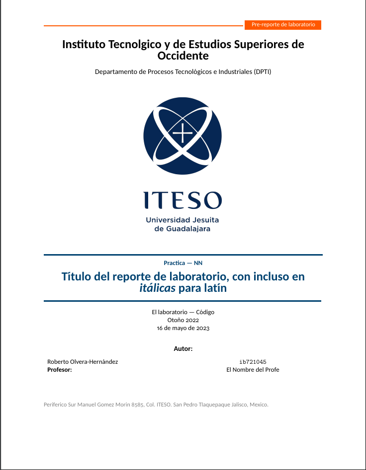
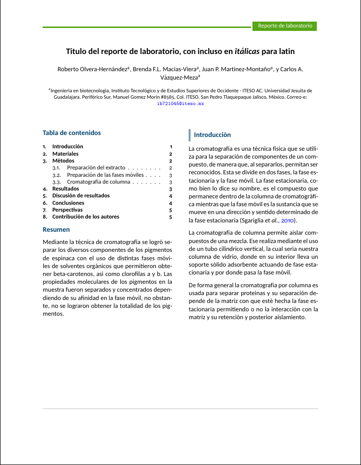
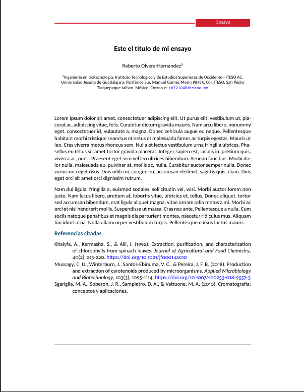
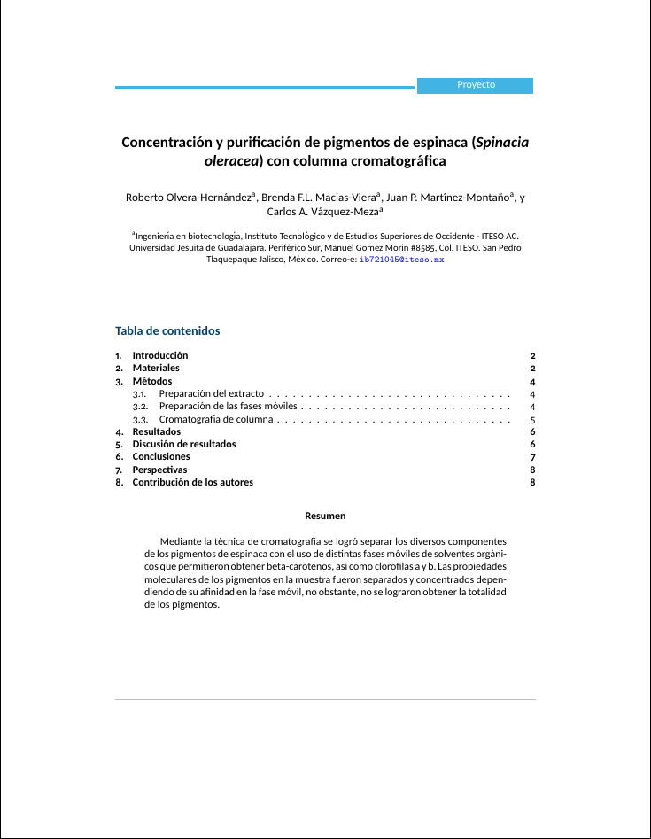

# LaTeX Collection for Academic Writings - ITESO
An **unofficial** set of LaTeX templates for academic writing for *Instituto Tecnológico de Estudios Superiores de Occidente (ITESO)*, based on documentation given by the BSc. Biotechnology Engineering academical coordination.

<div align="center">
    <table width="100%" margin-left="auto" margin-right="auto">
        <tr>
            <th>Lab PreReport</th>
            <th>Lab Report</th>
        </tr>
        <tr>
            <td width="33%">
            
            <td width="33%">
            
        </tr>
    </table>
    <table width="100%" margin-left="auto" margin-right="auto">
        <tr>
            <th>Essay</th>
            <th>Project</th>
        </tr>
        <tr>
            <td width="33%">
            
            <td width="33%">
            
        </tr>
    </table>
</div>

# Installation
Each directory contains a specific Class file (`.cls`) for each type of document, be sure to have your `.cls` in the same directory as your main `.tex` file to run properly. Add the name of the class in `\documentclass[]{}` to run properly at the beginning of your LaTeX file.

```latex
\documentclass{ITESO-Ensayo} %% No options yet, just add the class.
\usepackage[spanish]{babel}
\usepackage[sfdefault]{carlito}
\usepackage{csquotes}
\usepackage[style=apa, backend=biber]{biblatex}
    \DefineBibliographyStrings{spanish}{
    andothers = {\em et\addabbrvspace al\adddot}
    }
\usepackage{lipsum}
```
After this, everything should run smoothly.